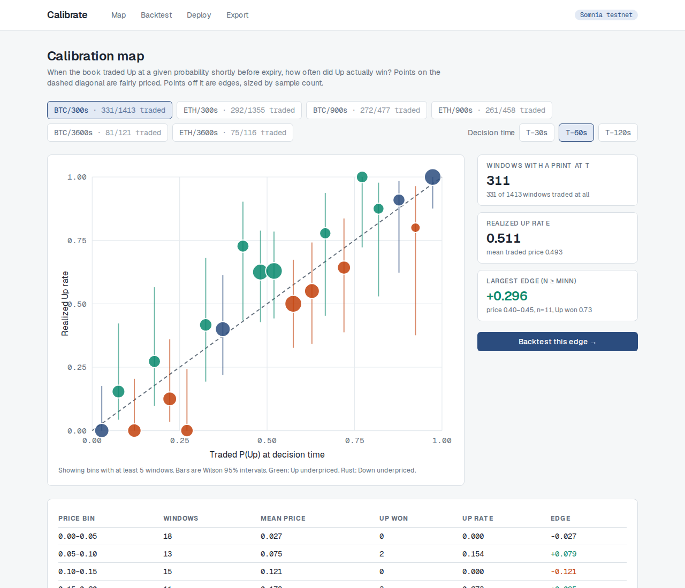
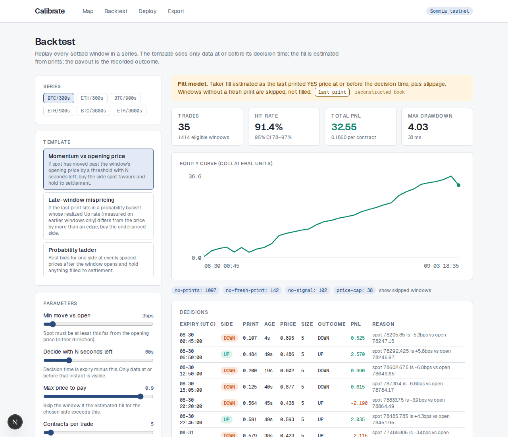
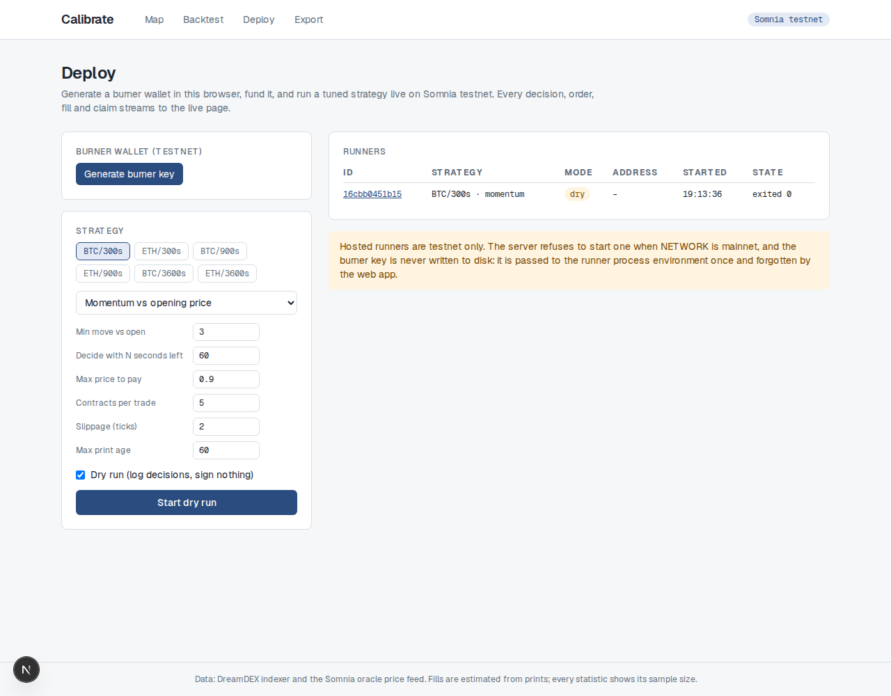
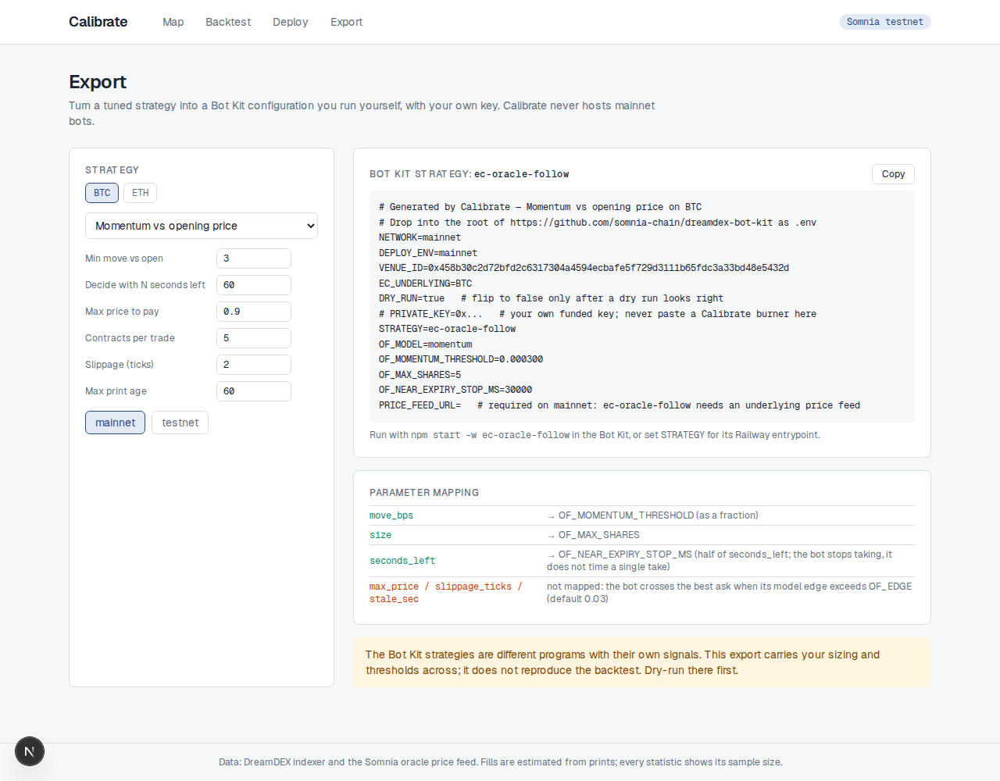

# Calibrate

**Find the edge in settled DreamDEX Event Contract windows, backtest it against real fills and oracle prices, and run it live on Somnia from a burner wallet. No code.**

Built for the Somnia × DreamDEX Event Contracts Hackathon on `@somnia-chain/markets-sdk` 0.28.1. Every number on every page comes from the DreamDEX indexer, the Somnia oracle price feed, or a direct chain read, and every claim in this repository is backed by a log in `docs/verification/`.



*BTC five-minute windows, 60 seconds before expiry. X is the traded probability of Up, Y is how often Up actually won. Dots on the dashed diagonal are fairly priced. Dot size is sample count; bars are Wilson 95% intervals. 311 windows with a print at that instant, out of 1,406 settled windows.*

## The problem it solves

Event Contracts are binary Up/Down windows on BTC and ETH that expire every 5, 15 or 60 minutes, settle against the Somnia oracle, and pay 1 collateral per winning contract. They need trading volume, and volume comes from bots. Today only developers who wire up the Bot Kit run strategies, and nobody, developer or not, can tell whether a strategy is any good before risking money. Nothing in the Bot Kit or the SDK backtests event contracts; the kit's backtester is spot only.

Event contracts have one property spot markets never had: a clean, timestamped, binary answer for every window, thousands of times a week. Calibrate is built on that.

## What a user does

1. **Map.** Pick a series (asset × window length). See where the book was miscalibrated shortly before expiry, with sample sizes on every bin.
2. **Backtest.** Pick one of three settlement-payoff templates, tune it with sliders, and replay every settled window in the series. The template sees only data at or before its decision time; the payout is the recorded outcome. Re-runs take about 50 milliseconds.
3. **Deploy.** Generate a burner key in the browser, mint testnet collateral from the faucet, start the strategy. The runner uses the same template code, the same acceptance rules, and Bot Kit's `ec-core` write path.
4. **Live.** Watch decisions, orders, fills and settlements stream in, with the backtest projection for the same parameters beside the realized numbers.
5. **Export.** For mainnet, render a Bot Kit configuration and run it yourself with your own key. Calibrate never hosts a mainnet bot.



*Momentum vs opening price on BTC/300s with the default 3 bps threshold: 35 trades, 91.4% hit rate (95% interval 78 to 97%), under the last-print fill model. The toggle beside the fill-model note switches to a reconstructed order book, which prices the same trades at the standing ask. See "Two fill models" below for why both are shown.*

## How it uses the SDK

Calibrate treats `@somnia-chain/markets-sdk` as the source of truth and the chain as the arbiter. Reads go through `exchange.client`, writes through `exchange.trader`, and the Bot Kit's `ec-core` helpers (vendored under MIT) wrap the write path so every order is grid-snapped, expiry-capped and receipt-checked the way the kit does it.

| Need | SDK surface | Where |
|---|---|---|
| Settled windows per series | `client.listPastBinaryMarkets({venueId, asset, intervalSec, status: "Finalized", limit, offset})` | `services/data/src/sync.ts` |
| Live windows | `client.listLiveBinaryMarkets`, ec-core `activeMarkets` (`loadMarkets`) | runner, deploy page |
| Trade prints | `client.getFills(pool, {since, until})`, filtered to `fill.market === marketId` because pools are recycled | sync, runner |
| Resolution and reference prices | `client.getMarketResolution`, `client.getOpeningPrices` | sync, runner |
| Underlying spot, live | `exchange.fetchPrice(asset)` | runner |
| Underlying spot, history | the oracle price feed behind `SOMNIA_TESTNET_PRICE_FEED` (`PricePoint` ticks, about one per second) | sync |
| On-chain gate before any write | `client.getMarketOnchain(marketId).status === 1` | runner, write-path script |
| Book grid from chain, never defaults | `client.getBinaryBookParams(pool)` | runner startup |
| Order book from chain | `client.getBinaryOrderBook(pool, {depth})` | runner snapshots, write-path script |
| Resting orders | `client.getAllOpenOrdersOnchain(pool, {isBid})` | verification |
| Placing orders | ec-core `placeLimit` → `trader.placeOrder` with `ORDER_TYPE.MARKET` (IOC) or `POST_ONLY`, `expireTimestampNs` capped at market expiry | runner |
| Cancelling on stop | ec-core `cancelTracked` → `trader.cancelOrder` | runner shutdown |
| Claiming winnings | ec-core `maybeClaim` / `settledMarkets` → `trader.redeem` | runner loop, same key, serialized |
| Faucet | `trader.faucet({amount})` | deploy page, `scripts/verify/faucet.mjs` |
| Balances and outcome positions | `client.getOutcomeBalance`, viem `erc20Abi` reads | runner settlement, wallet route |
| Venue and fee facts | `client.listBinaryVenueIds`, `client.getMarketFees` | verification |
| Chains and addresses | `somniaShannon` / `somniaMainnet` from `@somnia-chain/markets-sdk/chains`, `SOMNIA_TESTNET_ADDRESSES` | everywhere |

Two raw GraphQL queries exist, both in one file (`services/data/src/gql.ts`), for what the SDK does not expose: `Order` rows by `market_id` (the SDK's `getOrders` is per owner) and `PricePoint` pagination by `blockTimestamp` (the SDK's `fetchPriceHistory` has no cursor). Field names were confirmed by schema introspection.

### Gotchas from the docs, and where each is handled

| Documented gotcha | Handling |
|---|---|
| Gate on on-chain status, not the indexer | `getMarketOnchain` before every decision; the runner never trades a market that is not `Trading` |
| PostOnly that would cross reverts | ladder rungs go through ec-core `placeLimit`, which throws on the revert and the runner logs it per rung |
| Float prices off the tick grid on 18-decimal venues | prices and sizes are converted in integer tick and lot units (`packages/shared/src/units.ts`, unit-tested for the 0.05 case) |
| Every order needs an expiry no later than market expiry | ec-core caps `expireTimestampNs` at `onchain.expiry` |
| Limit remainders rest with escrow locked | taker templates send IOC only; the ladder is the one template that rests, on purpose, with expiry at market lock |
| Reverted receipts do not throw | `assertTxOk` on every write |
| Winnings are claimed, not received | `maybeClaim` in the runner loop; `settledMarkets` uses `listBinaryMarkets({status: "Finalized"})` because `loadMarkets` skips finalized markets |
| Pools are recycled across windows | everything is keyed by `marketId`; fills are filtered by market id, never by pool alone |
| Question text changes | opening price and interval come from typed fields (`openingAnswer`, `intervalSec`), never from parsing the question |
| Nonce collisions on one key | one key per runner; orders and claims on one serialized loop |

### Facts verified against the SDK that differ from the docs

These came out of installing 0.28.1 and probing the live endpoints before writing a line of product code (`PLAN.md` §2 and §3, logs in `docs/verification/`):

- `createClient` is not exported from the main entry; construct `new SomniaMarkets({...})` and use `.client` and `.trader`. A key is optional, so read-only services never hold one.
- On the DreamDEX testnet venue `strike` is `0`; the reference price is the opening oracle answer, a 2-decimal fixed-point string (`8117664` is 81176.64). Another testnet venue carries explicit strikes. The data layer reads the opening answer first and falls back to a non-zero strike.
- On-chain tick, lot and minimum quantity are 1000 raw on testnet (6 decimals) and 1e15 on mainnet. The Bot Kit's testnet lot default is 1; the runner reads the pool's parameters at startup and passes them to ec-core.
- The oracle price feed keeps tick-level history since 21 July 2026 for `BTC/USDC` and `ETH/USDC`. The momentum template therefore backtests against the same feed the oracle settles on, tick by tick.
- The Bot Kit strategies read their own `OF_*`, `GRID_*` and `EC_UNDERLYING` variables at import time, before ec-core loads `.env`. The export page says to apply them as process environment, which was confirmed by running the kit both ways.

## The data underneath

Five days of the DreamDEX testnet venue, synced by `npm run sync`:

| | |
|---|---|
| Settled windows | 3,920 (BTC and ETH × 300 s, 900 s, 3600 s) |
| Fills | 4,855 |
| Order rows (for book reconstruction) | 1.2 million |
| Oracle price ticks | 808,051 (both assets, full range) |
| Sync time | 33 minutes at concurrency 4; about 10 minutes with `--skip-orders` |

Every stored window carries its fills, the orders that rested during it, its opening and closing oracle answers, its outcome, and the spot ticks around it. A spot-check script re-reads one window from the indexer and compares it field by field; the calibration table is reproduced by a single SQL statement that bypasses the TypeScript.

## Two fill models, on purpose

A backtest is only as honest as its fill assumption. Calibrate ships two and shows both.

| Fill model | What it pays | BTC/300s momentum, 5 days |
|---|---|---|
| Last print + 2 ticks | the last traded YES price at or before the decision time | 38 trades, 89.5% hit rate, PnL 32.6 |
| Reconstructed book + 2 ticks | the best standing quote rebuilt from indexer order history at that second | 17 trades, 82.4% hit rate, PnL 1.5 |

The last print is usually where a maker got hit, near the bid. A taker pays the ask. The reconstruction was checked against 126 exact chain snapshots written by the runner: best bid matched in 77% of seconds and best ask in 79%, and every miss was a one-tick timing offset while a maker requoted (`docs/verification/compare-book.log`). The lower number is the honest one, and the demo script says so.

Other rules the engine never bends: the mispricing template's calibration is walk-forward (a window's own outcome enters the table only after its decision), windows with no fresh print are skipped rather than filled, voided windows pay 0.5 per side, fees are zero because the indexer reports zero maker, taker, routing and settlement fees for this venue.

## Live runner



The runner is one process per strategy and one key per process. On every tick it lists live markets, gates each on its on-chain status, snapshots the chain order book into the database (building exact book history for future backtests), builds the same `DecisionContext` the backtester uses, calls the same template function, and places through ec-core. On stop it cancels its resting orders and exits 0. It refuses to start on mainnet, and the web server refuses to spawn it there.

Key handling: the burner key is generated in the browser with `viem/accounts.generatePrivateKey`, kept in `sessionStorage`, sent once to the local server when a live run starts, placed in that child process's environment, and never written to disk.

What the runner emits, from a recorded dry run on BTC/300s (`docs/verification/runner-dryrun2.jsonl`), one JSON object per line:

```
{"type": "bookParams", "pool": "0x2aa87ab604568374bbe98caf308273cc0dd7085a", "tickSize": "1000", "lotSize": "1000", "minQuantity": "1000"}
{"type": "decision", "marketId": "0x000000000000000000000000000000000000000000000000000000000001285d", "secondsLeft": 117, "side": "UP", "limit": 0.72, "size": 5, "printProb": 0.718, "printAge": 27, "spot": {"price": 81274.6225, "ts": 1788463085}, "openRef": 81215.81, "reason": "spot 81274.6225 is +7.2bps vs open 81215.81"}
{"type": "order", "marketId": "0x000000000000000000000000000000000000000000000000000000000001285d", "dryRun": true, "side": "UP", "limit": 0.72, "size": 5}
```

Book parameters came from the pool on chain, the decision fired 117 seconds before expiry from a 27-second-old print with live spot against the window's opening reference, and the dry order was logged instead of signed. The `/live/[id]` page streams these events and shows realized PnL beside the backtest projection for the same parameters.

## Export



The export page maps a tuned template onto the closest Bot Kit strategy (`ec-oracle-follow` for momentum, `ec-laddering-bot` for the ladder) using the variable names from the kit's own README tables, lists what is not mapped, and warns that the kit's strategies are different programs. The exported configuration was run under the kit in dry-run mode and logged intended takes (`docs/verification/botkit-export-dryrun.log`).

## Architecture

```
apps/web (Next.js 16, Tailwind v4)
  /            calibration map            GET  /api/calibration
  /backtest    templates + sliders        POST /api/backtest
  /deploy      burner, faucet, start      GET/POST /api/wallet, /api/runners
  /live/[id]   SSE event stream           GET  /api/runners/[id]/events
  /export      Bot Kit config
        │ reads SQLite, spawns runners
services/data       sync CLI → data/calibrate.sqlite; features; calibration; book reconstruction
services/backtest   templates (shared with the runner), engine, metrics, CLI, hand-check
services/runner     live process on ec-core + the same templates; JSONL events
packages/shared     units (6/18/2-decimal scales), networks, venues, row types
packages/ec-core    vendored from somnia-chain/dreamdex-bot-kit (MIT)
```

## Verification, reproducible

Every plan step has a record in `docs/steps/` with the exact commands and their output. `docs/README.md` is the gate table. To reproduce the main checks on a synced database:

```
npm test                                                     # 27 unit tests across shared, backtest, ec-core
npm run typecheck                                            # all six workspaces
npm run spotcheck                                            # one stored window vs a fresh indexer read
npx tsx services/data/src/verify-calibration.ts BTC 300 60   # calibration table vs raw SQL: ALL BINS MATCH
npx tsx services/backtest/src/handcheck.ts --n 10            # engine vs raw-SQL recomputation: ALL 10 MATCH
npx tsx services/data/src/compare-book.ts                    # book reconstruction vs chain snapshots
node scripts/verify/market-fees.mjs                          # venue fees from the indexer (all zero)
```

The planning-phase probes that established the SDK facts are in `scripts/verify/*.mjs` with their outputs in `docs/verification/*.log`.

## Run it

```
cp .env.example .env                       # verified testnet endpoints; add PRIVATE_KEY only for the on-chain scripts
npm install
npm approve-scripts --allow-scripts-pending && npm rebuild esbuild   # esbuild's postinstall is gated on some npm setups
npm run sync -- --days 5                   # or --days 1 --skip-orders for a quick start
npm run web -- --port 3210                 # http://localhost:3210
```

Requires Node 22.5 or newer (the database is Node's built-in `node:sqlite`).

## Status

Steps 0 to 5, 8 and 9 of `PLAN.md` are complete and verified. Step 6 (a real faucet call, IOC buy and redeem on testnet) and the live-fire half of step 7 wait on STT gas for the burner in `docs/verification/burner-address.txt`; the scripts are ready and the dry-run path is verified end to end. Nothing here claims an on-chain result that has not happened.

The venue's schedule moves: on 2026-09-08 the testnet DreamDEX venue listed only 4-hour and 24-hour windows, while the five days in the database are five-, fifteen- and sixty-minute windows. The deploy page offers whatever series the database holds; a runner on a series with no live window logs its ticks and places nothing.

## Honesty notes for judges

- The calibration map shows where to look, not a proven money machine. At 10 to 30 windows per bin the intervals are wide, and the walk-forward mispricing backtest on BTC/300s is flat to slightly negative. The pages show sample sizes and confidence intervals everywhere for that reason.
- Trading on the testnet venue is concentrated in the most recent day and a half of the five-day sample; roughly a quarter of five-minute windows carry a print.
- The ladder template's backtest is an upper bound on fills: queue position is not simulated, and the UI says so.

## Licence

MIT. `packages/ec-core` is DreamDEX S.A.'s code under its MIT licence, unchanged apart from the package name.
